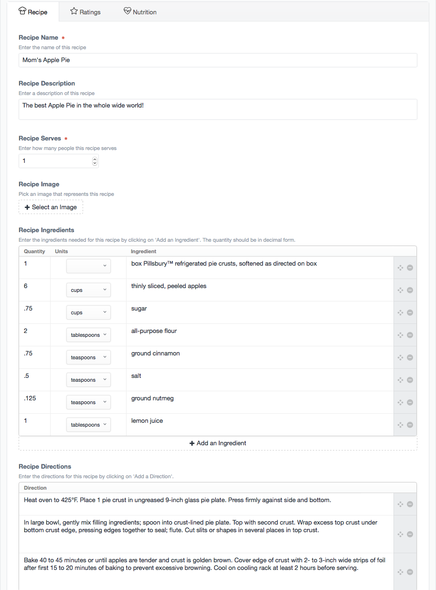

# Recipe plugin for Craft CMS

A recipe FieldType for Craft CMS that includes microdata support

## Installation

To install Recipe, follow these steps:

1. Download & unzip the file and place the `recipe` directory into your `craft/plugins` directory
2.  -OR- do a `git clone https://github.com/nystudio107/recipe.git` directly into your `craft/plugins` folder.  You can then update it with `git pull`
3. Install plugin in the Craft Control Panel under Settings > Plugins
4. The plugin folder should be named `recipe` for Craft to see it.  GitHub recently started appending `-master` (the branch name) to the name of the folder for zip file downloads.

Recipe works on Craft 2.4.x, Craft 2.5.x, and Craft 2.6.x.

## Recipe Overview

-Insert text here-

## Configuring Recipe

-Insert text here-

## Using Recipe

To display information about a recipe in your templates, you just use familiar Twig code.  Let's assume the field handle for your Recipe field is `someRecipe`; this is what you'd use to output information about it:

* `{{ entry.someRecipe.name }}` - the name of the recipe
* `{{ entry.someRecipe.description }}` - the description of the recipe
* `{{ entry.someRecipe.serves }}` - how many people the recipe serves
* `{{ entry.someRecipe.getImageUrl() }}` - a URL to the image for the recipe
* `{{ entry.someRecipe.prepTime }}` - the prep time for the recipe in minutes
* `{{ entry.someRecipe.cookTime }}` - the cooking time for the recipe in minutes
* `{{ entry.someRecipe.prepTime }}` - the total time for the recipe in minutes

For a list of ingredients, do the following (adding whatever output markup you want):

    
    
        {{ ingredient }}
    

The first parameter is the units you'd like to use (`'imperial'` or `'metric'`).  The second parameter is how many people you'd like the recipe portions to be sized for.  If you leave out the second parameter, it'll just use the recipe default.

For a list of directions, do the following (adding whatever output markup you want):

    
    
        {{ direction }}
    

If you need to do any further manipulation of the Recipe Image (perhaps a transform) you can get the Asset ID for it:

* `{{ entry.someRecipe.imageId }}` - the Asset ID of the image for the recipe

For a list of the ratings, do the following (adding whatever output markup you want):

    
    
        {{ rating.rating }} {{ rating.review }}
    

For the aggregate (average) rating for this recipe, do the following (adding whatever output markup you want):

    {{ entry.someRecipe.getAggregateRating() }}

To output the nutritional information for the recipe, do the following:

* `{{ entry.someRecipe.servingSize }}` - The serving size, in terms of the number of volume or mass
* `{{ entry.someRecipe.calories }}` - The number of calories per serving
* `{{ entry.someRecipe.carbohydrateContent }}` - The number of grams of carbohydrates per serving
* `{{ entry.someRecipe.cholesterolContent }}` - The number of milligrams of cholesterol per serving
* `{{ entry.someRecipe.fatContent }}` - The number of grams of fat per serving
* `{{ entry.someRecipe.fiberContent }}` - The number of grams of fiber per serving
* `{{ entry.someRecipe.proteinContent }}` - The number of grams of protein per serving
* `{{ entry.someRecipe.saturatedFatContent }}` - The number of grams of saturated fat per serving
* `{{ entry.someRecipe.sodiumContent }}` - The number of milligrams of sodium per serving
* `{{ entry.someRecipe.sugarContent }}` - The number of grams of sugar per serving
* `{{ entry.someRecipe.transFatContent }}` - The number of grams of trans fat per serving
* `{{ entry.someRecipe.unsaturatedFatContent }}` - The number of grams of unsaturated fat per serving

## Recipe Roadmap

Some things to do, and ideas for potential features:

* Release it

## Recipe Changelog

### 1.0.0 -- 2016.04.28

* Initial release

Brought to you by [nystudio107](http://nystudio107.com)